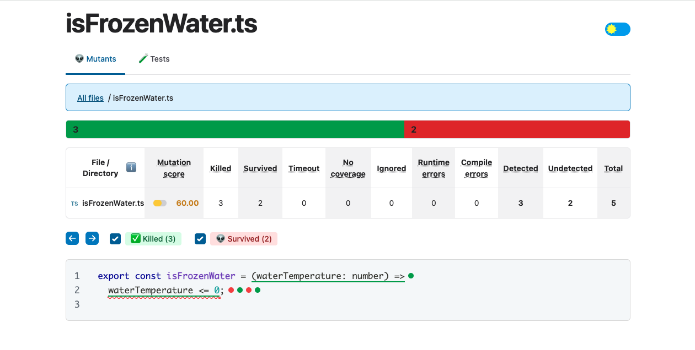
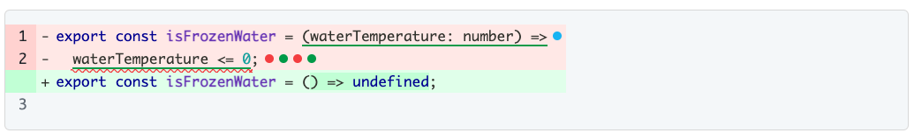
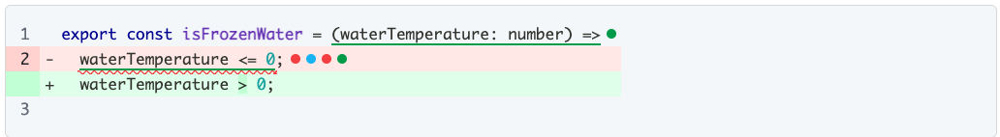
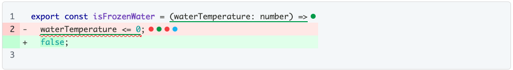
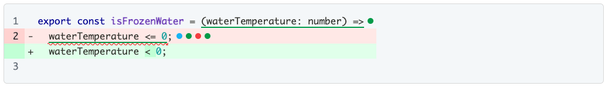
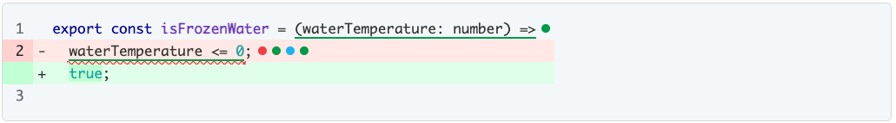

# Mutation Testing en JS con Stryker

_Exploramos las ventajas de utilizar una herramienta como Stryker para aportar fiabilidad a los test unitarios de nuestro código mediante las pruebas de mutaciones._

Supongamos que tenemos un proyecto con una buena batería de tests unitarios, que nos ha asegurado una cobertura de código muy alta (es decir, las lineas de código que han ejecutado nuestros test). Estamos satisfechos con ese dato, y pensamos que podremos pasar la noche tranquilos, sin tener pesadillas con bugs inesperados. Pero antes de cerrar los ojos para dormir, una duda nos asalta:

## ¿Quién testea los tests?

O en otras palabras: ¿cuánto confiamos en los tests unitarios de nuestro código? ¿es la cobertura un dato fiable?

Mi resupesta a la última pregunta es... no necesariamente. Veámoslo en un par de ejemplos:

1. Nuestro test puede cubrir "falsos positivos" 🥸:<br/>
   dada esta función que retorna si el agua está congelada según una temperatura dada:

   ```javascript
   const isFrozenWater = (waterTemperature: number) => waterTemperature <= 0;
   ```

   podemos obtener un 100% de cobertura de la función únicamente añadiendo este test:

   ```javascript
   test("should return true when the temperature of the water is -15ºC", () => {
     const isIce = isFrozenWater(-15);
     expect(isIce).toBe(true);
   });
   ```

   pero, ¿qué pasaría si la función `isFrozenWater` se modificara por error?

   ```javascript
   const isFrozenWater = (waterTemperature: number) => waterTemperature < 0;
   ```

   Nuestro test seguiría siendo válido, y la función estaría cubierta al 100%, pero la funcionalidad no es correcta.

2. Nuestro test puede no estar probando nada 🤥:<br/>
   ¿quién no se ha encontrado alguna vez un repositorio con tests sin ningún expect asociado, añadidos únicamente con objeto de recorrer el código y cumplir con la cobertura mínima que establece el CI/CD?
   Dada la misma función `isFrozenWater` del punto anterior, podríamos conseguir un 100% de cobertura con este test:

   ```javascript
   test("should return true when the temperature of the water is -15ºC", () => {
     const isIce = isFrozenWater(-15);
     //usamos un fake expect que nunca fallará, y que es agnóstico a lo que se pretende testear 😵
     expect(true).toBe(truthy);
   });
   ```

   o, incluso, con éste:

   ```javascript
   test("should return true when the temperature of the water is -15ºC", () => {
     const isIce = isFrozenWater(-15);
     //sólo se ejecuta la función, no se testea nada 😱
   });
   ```

## Incorporando el concepto de "mutantes"

Las pruebas de mutación consisten en introducir pequeñas alteraciones (o **_mutantes_**) en el código que se va a testear para, a continuación, ejecutar las pruebas unitarias con el código modificado. Cada mutante debería hacer que algún test falle; en ese caso, se ha eliminado (_mutant is killed_), de lo contrario, ha sobrevivido (_mutant survived_).

De esta forma, estamos generando una nueva medida de calidad, mucho más fiable que la cobertura, llamada "% de mutantes eliminados" (_% of mutants killed_). Nuestro código será más seguro cuanto más cercano esté este índice al 100%.

Estos son los mutantes más comunes que podemos encontrar en este tipo de pruebas:
| Original | Mutante |
| ---------------------------- | :------------------------------ |
| `a + b` | `a - b` |
| `a / b` | `a * b` |
| `a < b` | `a > b` |
| `a === b` | `a !== b` |
| `a && b` | <code>a &#124;&#124; b</code> |
| `a ?? b` | `a && b` |
| `const company = "innusual"` | `const company = ""` |
| `const list = [1, 2, 3, 4]` | `const list = []` |
| `if (a > b) { ... }` | `if (true) { ... }` |
| `function fn() { ...}` | `function fn() { /* EMPTY */ }` |

Para añadir pruebas de mutaciones en Javascript, la librería más popular es Stryker Mutator.

## Stryker

Además del súper enemigo de los X-Men, Stryker es una herramienta de código abierto diseñada originalmente para Javascript (aunque ya han incorporado versiones para C# y Scala)... y a ambos les encanta matar mutantes.

Es fácil de instalar y configurar, con una documentación minuciosa y amena, y nos ofrece una interfaz visual muy intuitiva de los mutantes que crea y el resultado de aplicar nuestros test sobre ellos.

Empezar a usar Stryker en nuestro proyecto es muy sencillo.

El primer paso es instalar el paquete de npm que nos descargará el `cli` de Stryker:

```
 $ npm install -g stryker-cli
```

Después instalaremos Stryker en el proyecto ejecutando:

```
 $ npm init stryker
```

Este comando nos hará una serie de preguntas sobre el proyecto para configurar Stryker según esos parámetros.
A esta configuración inicial, le añadiremos las modificaciones que consideremos necesarias (archivos a analizar o ignorar, formato de los reportes, deshabilitar cierto tipo de mutantes, etc).

Ya podemos ejecutar Stryker:

```
 $ npx stryker run
```

En nuestro ejemplo anterior, obtendríamos el siguiente resultado:



Se han creado 5 mutantes para el método `isFrozenWater`, y nuestro test ha podido eliminar 3 de ellos.

- 💀 se han eliminado:
  
  
  

- 👽 han sobrevivido:
  
  Para eliminar este mutante, vamos a añadir un test con un valor "de borde", que compruebe qué ocurre cuando la temperatura es 0ºC:

  ```javascript
  test("should return true when the temperature of the water is 0ºC", () => {
    const isIce = isFrozenWater(0);
    expect(isIce).toBe(true);
  });
  ```

  
  Para eliminar este mutante, vamos a añadir un test que compruebe qué ocurre cuando la temperatura es mayor a 0ºC:

  ```javascript
  test("should return false when the temperature of the water is 15ºC", () => {
    const isIce = isFrozenWater(15);
    expect(isIce).toBe(false);
  });
  ```

  Tras añadir los dos nuevos test, si volvemos a ejecutar Stryker, veremos que el "mutation score" ha subido al 100%:


Igual que al inicio, tenemos cobertura del 100% del código, pero ahora nuestras pruebas unitarias son mucho más robustas.

## Consideraciones a tener en cuenta

Cuando añadimos una herramienta como Stryker a nuestros proyectos, es de vital importancia afinar al máximo posible la configuración, ya que el principal problema de este tipo de pruebas es el tiempo de ejecución que requieren (pensemos que va a ejecutar los test por cada mutante que se genere):

- Debemos restringir la ejecución de las pruebas únicamente a los archivos que están siendo testeados (y excluir los archivos de test unitarios, ya que éstos no los queremos mutar), para no generar mutantes innecesarios.
- Debemos configurar el tipo de mutaciones que queremos que se aplique al código, ya que de lo contrario, se aplicarán todas por defecto y la mayoría de las veces no todas son necesarias.

Además de la propia configuración de Stryker, debemos tener en cuenta que, debido a los tiempos tan largos de ejecución de los tests de mutación, hay que valorar si es conveniente añadirlos a las pipelines de CI/CD (es compatible la [integración con SonarQube](https://stryker-mutator.io/docs/mutation-testing-elements/sonarqube-integration/)), o quizá sea mejor opción programar una ejecución periódica, o puntual en ciertas partes sensibles del código.

## Conclusiones

Como hemos visto, las pruebas de mutación son útiles para medir la calidad de nuestros test unitarios, comprobar que son efectivos y que no los hemos metido con el único objetivo de aumentar la cobertura de nuestro proyecto. Stryker es una herramienta muy potente y de uso sencillo para implementar estas pruebas en Javascript, y nos ayuda a encontrar tests que se nos han olvidado y asegurar más nuestro código en las zonas más críticas.
pero tenemos que saber interpretar los datos que nos da y decidir si debemos añadir tests, o bien modificar nuestro código para que mate todas las mutaciones sin perder legibilidad.

## Bonus Track

- Documentación oficial de [Stryker Mutator](https://stryker-mutator.io/)
- charla ["Who's testing the tests?"](https://fosdem.org/2024/schedule/event/fosdem-2024-1683-who-s-testing-the-tests-mutation-testing-with-strykerjs/), de Nico Jansen en la FOSDEM'24
